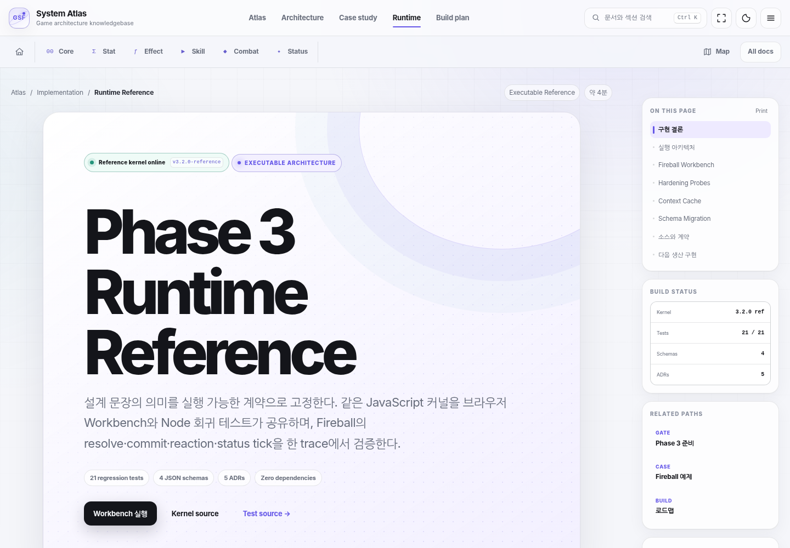

<p align="center">
  <strong>Production</strong> · <a href="https://jy-lemongo.github.io/GameSystemKnowledge/">https://jy-lemongo.github.io/GameSystemKnowledge/</a><br />
  <strong>Preview</strong> · <a href="https://jy-lemongo.github.io/GameSystemKnowledge/preview/">https://jy-lemongo.github.io/GameSystemKnowledge/preview/</a>
</p>

<h1 align="center">Game System Framework · System Atlas</h1>

<p align="center">
  <strong>C# 타입과 실행 가능한 계약으로 읽는 게임 시스템 아키텍처 학습 사이트</strong><br />
  Core Runtime부터 Stat, Effect, Skill, Combat, Status까지 책임과 연결 관계를 하나의 학습 경로로 정리한다.
</p>

<p align="center">
  <a href="https://jy-lemongo.github.io/GameSystemKnowledge/"><strong>학습 시작</strong></a>
  · <a href="https://jy-lemongo.github.io/GameSystemKnowledge/modules/integration-map.html">아키텍처 맵</a>
  · <a href="https://jy-lemongo.github.io/GameSystemKnowledge/modules/runtime-reference.html">Runtime Contract Lab</a>
  · <a href="https://jy-lemongo.github.io/GameSystemKnowledge/modules/diagram-gallery.html">다이어그램</a>
</p>

<p align="center">
  <a href="https://github.com/JY-LemongO/GameSystemKnowledge/actions/workflows/deploy-pages.yml"></a>
  
  
  
</p>

<p align="center">
  <a href="https://jy-lemongo.github.io/GameSystemKnowledge/modules/runtime-reference.html">
    
  </a>
</p>

## 이 프로젝트는 무엇인가

System Atlas는 게임 시스템을 기능 목록이 아니라 **타입, 책임, 데이터 흐름, 실행 경계**로 이해하기 위한 오프라인 우선 지식 사이트다. 최상위 `index.html`을 열면 별도 빌드 없이 문서를 읽을 수 있고, Runtime Contract Lab에서는 같은 계약이 실제 실행 결과로 어떻게 이어지는지 브라우저에서 관찰할 수 있다.

- **C#** — 핵심 타입과 계약, Fireball 수직 사례를 실제 빌드로 검증한다.
- **JSON** — 정의 데이터, 직렬화 형태, 실행 결과의 경계를 보여준다.
- **JavaScript** — 브라우저와 Node.js가 공유하는 런타임 커널로 결정성과 불변식을 검증한다.
- **UML** — 클래스, 시퀀스, 상태, 활동 다이어그램으로 시스템 간 연결을 시각화한다.

## 학습 경로

Atlas Home에서 전체 경로를 확인하고 여섯 개 핵심 시스템을 순서대로 읽는다. 이후 통합 맵과 Fireball 사례로 시스템을 연결한 뒤 Runtime Contract Lab에서 실행 결과를 확인한다.

| 순서 | 페이지 | 핵심 질문 |
| ---: | --- | --- |
| 01 | [Atlas Home](https://jy-lemongo.github.io/GameSystemKnowledge/) | 전체 경로와 추천 읽기 순서는 무엇인가? |
| 02 | [Core Runtime](https://jy-lemongo.github.io/GameSystemKnowledge/modules/core-runtime.html) | 모든 시스템이 공유하는 식별자와 실행 계약은 무엇인가? |
| 03 | [Stat](https://jy-lemongo.github.io/GameSystemKnowledge/modules/stat-system.html) | 기본값, Modifier, 현재 리소스는 어떻게 계산되는가? |
| 04 | [Effect](https://jy-lemongo.github.io/GameSystemKnowledge/modules/effect-system.html) | 대상 선택과 결과 요청의 책임을 어디서 나누는가? |
| 05 | [Skill](https://jy-lemongo.github.io/GameSystemKnowledge/modules/skill-action-system.html) | 비용, 쿨다운, 타겟팅, 타임라인은 어떻게 조율되는가? |
| 06 | [Combat](https://jy-lemongo.github.io/GameSystemKnowledge/modules/combat-resolution-system.html) | 피해 계산과 상태 변경의 commit 경계는 어디인가? |
| 07 | [Status](https://jy-lemongo.github.io/GameSystemKnowledge/modules/status-system.html) | 지속시간, 중첩, tick, 정화, 면역은 어떻게 동작하는가? |
| 08 | [Integration Map](https://jy-lemongo.github.io/GameSystemKnowledge/modules/integration-map.html) | 시스템 의존성과 handoff 계약은 어떻게 연결되는가? |
| 09 | [Fireball Case Study](https://jy-lemongo.github.io/GameSystemKnowledge/modules/fireball-case-study.html) | 하나의 스킬이 전체 시스템을 어떻게 통과하는가? |
| 10 | [Runtime Contract Lab](https://jy-lemongo.github.io/GameSystemKnowledge/modules/runtime-reference.html) | replay hash, trace, commit 결과를 어떻게 관찰하는가? |
| 11 | [Diagram Gallery](https://jy-lemongo.github.io/GameSystemKnowledge/modules/diagram-gallery.html) | UML 다이어그램을 유형별로 어떻게 읽는가? |
| 12 | [Glossary](https://jy-lemongo.github.io/GameSystemKnowledge/modules/glossary.html) | 용어와 UML 기초 문법을 어디서 빠르게 찾는가? |

## 실행 가능한 계약

문서의 설계 문장은 설명으로 끝나지 않는다. `source/csharp/`의 참조 프로젝트와 `source/runtime/`의 시뮬레이터가 같은 핵심 불변식을 서로 다른 실행 환경에서 검증한다.

```text
Definition Data → Runtime State → Decision Trace → Commit Event → Replay Verification
```

Runtime Contract Lab의 Fireball Workbench에서는 seed, 주문력, 대상 상태, 판정 정책을 바꾸고 다음 결과를 비교할 수 있다.

- 같은 입력이 같은 replay hash와 trace hash를 만드는가
- resolve와 commit 사이에서 어떤 값이 확정되는가
- shield, HP damage, status tick이 하나의 원인 체인으로 추적되는가
- 스키마 버전이 달라질 때 migration과 validation이 어떻게 동작하는가

## 빠르게 시작하기

### 공개 사이트

- 안정 버전: [Production](https://jy-lemongo.github.io/GameSystemKnowledge/)
- 다음 승격 후보: [Preview](https://jy-lemongo.github.io/GameSystemKnowledge/preview/)

### 로컬에서 보기

최상위 `index.html`을 브라우저에서 직접 열 수 있다. Runtime Contract Lab까지 같은 조건으로 확인하려면 저장소 루트에서 정적 서버를 실행한다.

```bash
npm run serve
```

## 저장소 구조

```text
GameSystemKnowledge/
├─ index.html                 # 전체 학습 경로
├─ modules/                   # 공개 학습 페이지 11개
├─ assets/                    # 공통 UI, 스크립트, 다이어그램
├─ source/
│  ├─ csharp/                 # 빌드 가능한 C# 계약 참조
│  ├─ runtime/                # 브라우저·Node 공유 런타임 커널
│  ├─ diagrams/               # 다이어그램 원본과 생성 입력
│  └─ site-map.json           # 공개 검색 색인의 기준
├─ tests/                     # 런타임·콘텐츠·브라우저 검증
└─ DEVELOPMENT_WORKFLOW.md    # 브랜치 역할과 승격 절차
```

## 유지보수 검증

```bash
npm run python:deps
npm run csharp:verify
npm run qa
```

`csharp:verify`는 외부 테스트 패키지 없이 C# 계약과 Fireball 기준 수치를 빌드·실행한다. `qa`는 JavaScript 런타임 테스트, C# 참조 검증, 내비게이션 문구 일치, 검색 색인 재생성, 정적 링크·계약 검증, 체크섬 manifest 확인, 데스크톱·모바일 브라우저 smoke test를 순서대로 실행한다.

파일을 변경한 뒤에는 `npm run site-shell`로 drawer·pager 설명을, `npm run manifest`로 `MANIFEST.sha256`을 갱신한다. 현재 브랜치 역할과 Preview → Production 승격 절차는 [DEVELOPMENT_WORKFLOW.md](DEVELOPMENT_WORKFLOW.md)에서 확인할 수 있다.

## 문서 경계

공개 HTML은 현재 설명하는 개념, 계약, 예제, 실습만 담는다. 구현 로드맵, 릴리스 현황, 품질 감사 결과, 앞으로의 기능 계획은 공개 학습 페이지와 검색 색인에 포함하지 않는다.

`QA_REPORT.md`, `PHASE3_REFERENCE_IMPLEMENTATION.md`, `PHASE3_IMPLEMENTATION_PLAN.md` 같은 파일은 당시 상태를 남긴 저장소 내부 검증·계획 기록이며, 공개 사이트의 학습 내비게이션과 분리한다.
